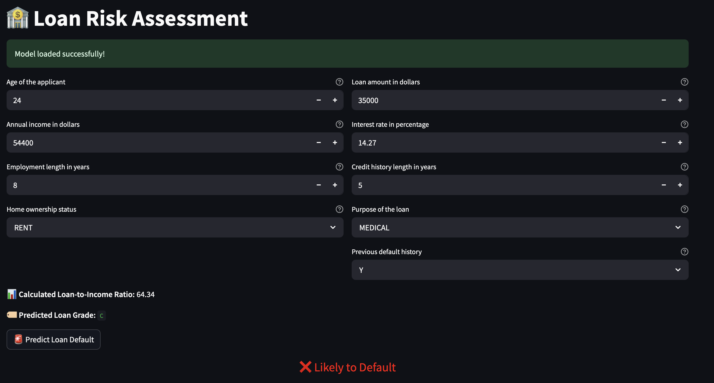
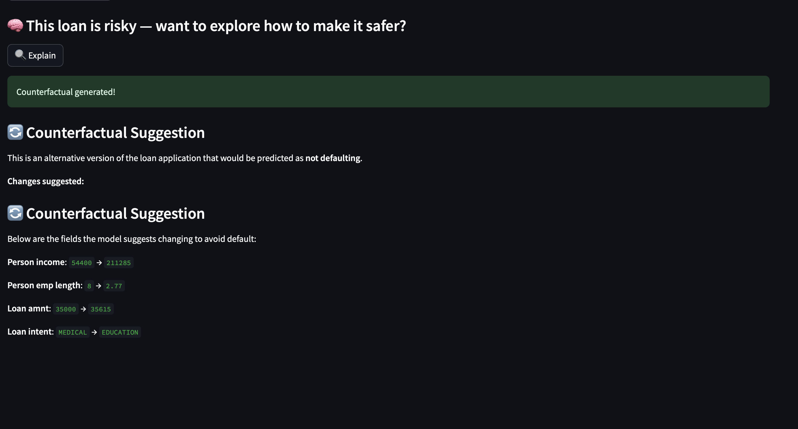

# Counterfactual Explanations for Credit Risk Prediction

## Overview

This project implements a comprehensive **Counterfactual Explanation** system, specifically tailored for **credit risk prediction** models. Counterfactual explanations offer valuable insights by identifying minimal yet plausible adjustments to input features that could alter a model’s decision (e.g., loan approval vs. rejection). Such explanations are particularly useful in finance and credit scoring, providing both lenders and applicants clarity on the influencing factors behind credit decisions and actionable pathways for improvement.

### Key Features
- **Feedforward Neural Network Model**: A robust model for classifying loan applications into categories such as \"approve\" or \"reject.\"
- **Counterfactual Explanations from Scratch**: Gradient-based optimization techniques to generate intuitive explanations for individual decisions.
- **Realistic Constraints**: Implements domain-specific constraints ensuring generated counterfactuals are actionable (e.g., not altering immutable attributes like age).
- **Comprehensive Visualization**: Interactive visualizations showcasing clear before-and-after comparisons of feature modifications.

## Methodology

The system employs advanced optimization techniques to ensure counterfactuals are valid, interpretable, and actionable:

- **Gradient Masking**: Ensures immutable features remain unchanged during optimization.
- **Differentiable Approximations**: Treats ordinal variables appropriately through soft-rounding.
- **Gumbel-Softmax Trick**: Maintains valid categorical representations by handling one-hot encoded features correctly.
- **Manual Feature Injection**: Preserves consistency of derived features (e.g., ratios) dynamically during optimization.

## Project Structure

```
.
├── LICENSE
├── README.md
├── configs
│   ├── counterfactual_explanations.yaml
│   ├── data.yaml
│   ├── features.yaml
│   └── models.yaml
├── data
│   ├── processed
│   └── raw
├── deploy
│   ├── __init__.py
│   └── app.py
├── imgs
│   ├── heatmap_of_change_final_version_of_CF.png
│   └── tensorboard_experiments.png
├── models
│   ├── encoder
│   ├── loan_grader
│   ├── model
│   └── scaler
├── notebooks
│   ├── __init__.py
│   ├── counterfactual_explanations.ipynb
│   ├── data_processing.ipynb
│   ├── exploratory_data_analysis.ipynb
│   ├── loan_grader_training.ipynb
│   └── model_training.ipynb
├── report.md
├── scripts
├── src
│   ├── __init__.py
│   ├── config_functions.py
│   ├── counterfactual_explanations.py
│   ├── data.py
│   ├── encoder.py
│   ├── loan_grader.py
│   ├── model.py
│   ├── scaler.py
│   └── utils.py
└── tests
    ├── __init__.py
    ├── test_counterfactual.py
    ├── test_loan_grader.py
    ├── test_model.py
    └── test_transformations.py
```

### Directory Descriptions

- **configs**: Configuration files for defining models, data processing steps, and counterfactual explanation constraints.
- **data**: Raw input datasets and processed data for modeling.
- **deploy**: Files necessary for deploying the application into production.
- **imgs**: Images generated during analysis, including visual explanations and experiment logs.
- **models**: Pre-trained model components including encoders, scalers, and classification models.
- **notebooks**: Interactive notebooks covering data exploration, processing, training, and generating counterfactual explanations.
- **src**: Core Python scripts implementing the data pipeline, model training, and counterfactual explanation generation.
- **tests**: Automated tests ensuring functionality and correctness across the codebase.

## Running the Project

1. **Installation**: Clone the repository and install required dependencies from `requirements.txt`.
2. **Data Preprocessing**: Execute the notebook `notebooks/data_processing.ipynb` to preprocess data. Processed data will be saved in the `data/processed/` directory.
3. **Model Training**: Run the notebook `notebooks/model_training.ipynb` to train the model. This will generate model weights necessary for further analysis.
4. **Counterfactual Explanations**: To explore our counterfactual approach in detail, open and execute `notebooks/counterfactual_explanations.ipynb`, which provides step-by-step explanations of our methodology and implementation.

## Deployment

Once the model weights have been obtained and configuration files have been updated with relevant file paths, the project can be interactively deployed through a Streamlit application. Run the following command in the terminal from the project root:

```bash
bash deploy.sh
```

This will launch the interactive application allowing users to explore and interact with the counterfactual explanation system.

What should you expect to see after you run the deployment:



## License

This project is licensed under the **MIT License**. For details, see [LICENSE](./LICENSE).

